# Tool 1 : Adding Team Member

# Organization
# - membuat organisasi


# - menambahkan repo


# - invite people


# - Adding Teams


# Collaborator
# - Add Collaborator dengan akses Read - Write


# Tool 2 : Pull Request
# Fork & pull mode


```
lenovo@DESKTOP-RMHTUQ1 MINGW64 ~/Documents/GitHub/Spoon-Knife (main)
$ git checkout -b readme.md
Switched to a new branch 'readme.md'

lenovo@DESKTOP-RMHTUQ1 MINGW64 ~/Documents/GitHub/Spoon-Knife (readme.md)
$ git add .

lenovo@DESKTOP-RMHTUQ1 MINGW64 ~/Documents/GitHub/Spoon-Knife (readme.md)
$ git commit -m "menambahkan readme"
On branch readme.md
nothing to commit, working tree clean

lenovo@DESKTOP-RMHTUQ1 MINGW64 ~/Documents/GitHub/Spoon-Knife (readme.md)
$ git checkout master
error: pathspec 'master' did not match any file(s) known to git

lenovo@DESKTOP-RMHTUQ1 MINGW64 ~/Documents/GitHub/Spoon-Knife (readme.md)
$ git branch
  main
* readme.md

lenovo@DESKTOP-RMHTUQ1 MINGW64 ~/Documents/GitHub/Spoon-Knife (readme.md)
$ git remote -v
origin  https://github.com/Froseth-Community/Spoon-Knife.git (fetch)
origin  https://github.com/Froseth-Community/Spoon-Knife.git (push)
upstream        https://github.com/octocat/Spoon-Knife.git (fetch)
upstream        https://github.com/octocat/Spoon-Knife.git (push)

lenovo@DESKTOP-RMHTUQ1 MINGW64 ~/Documents/GitHub/Spoon-Knife (readme.md)
$ git push origin readme
error: src refspec readme does not match any
error: failed to push some refs to 'https://github.com/Froseth-Community/Spoon-Knife.git'
```
# - pull request

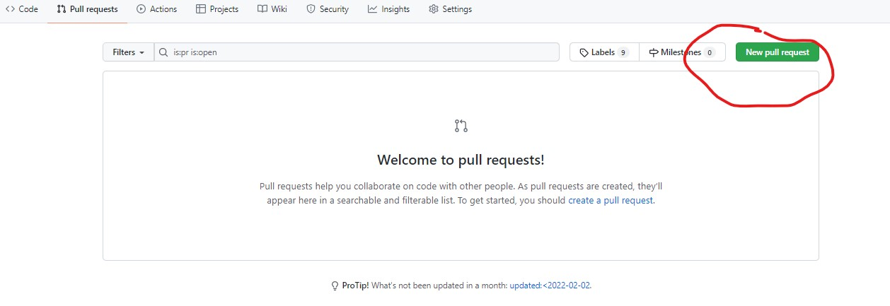
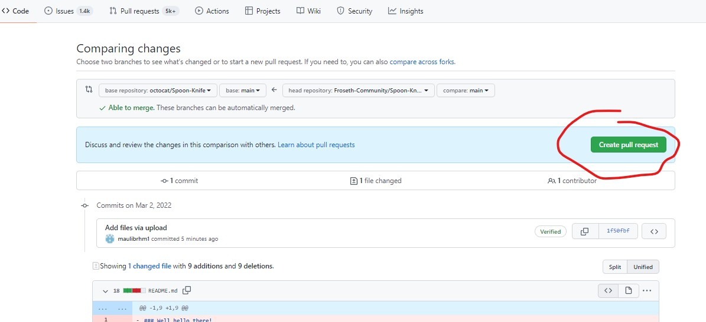
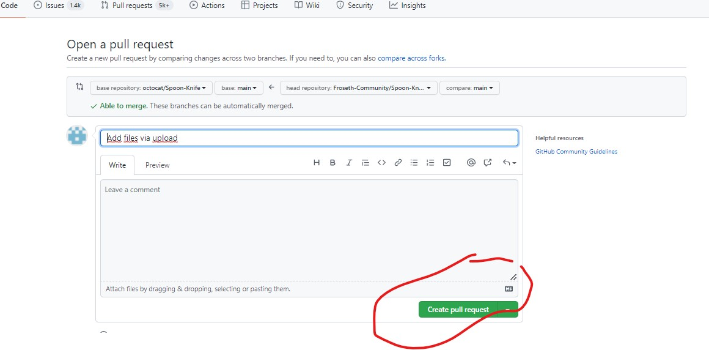


# Tool 3 : Bug Tracking

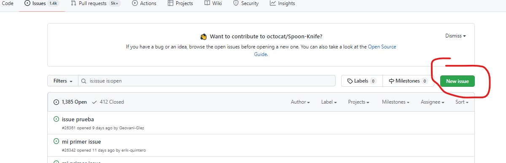
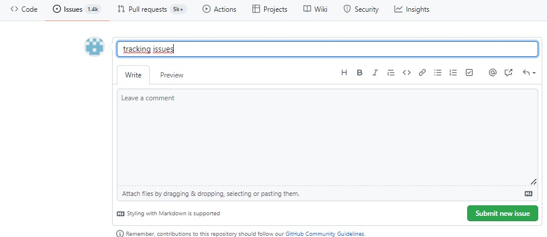
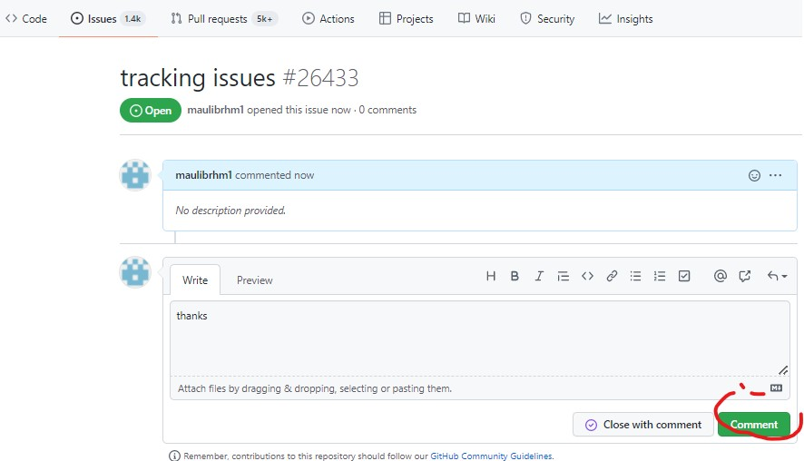
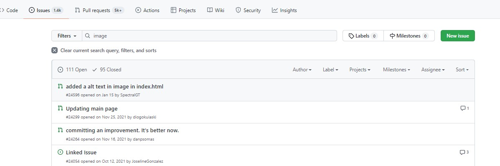
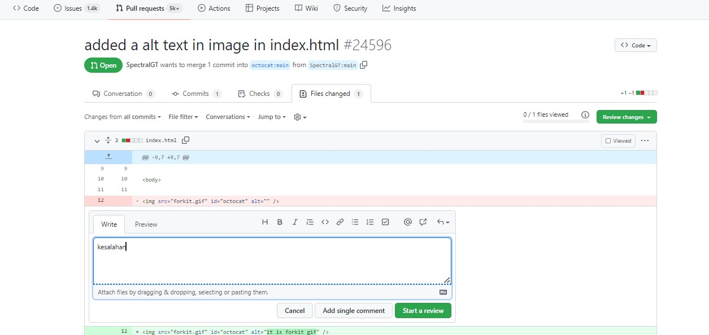
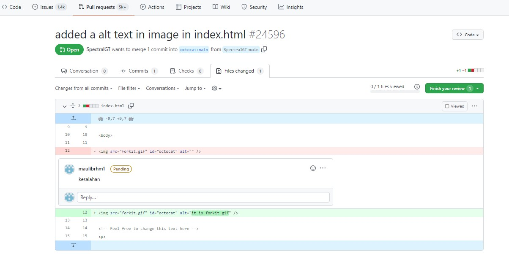
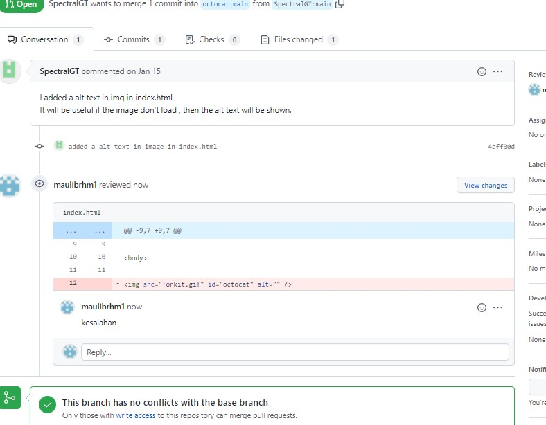


# Tool 4 : Analytics

# Insight/graph

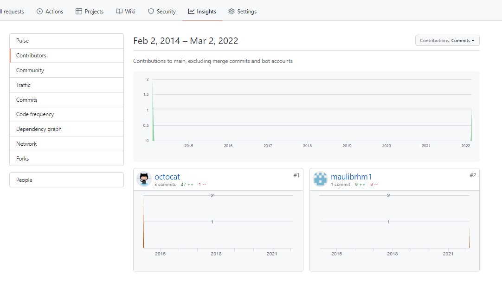
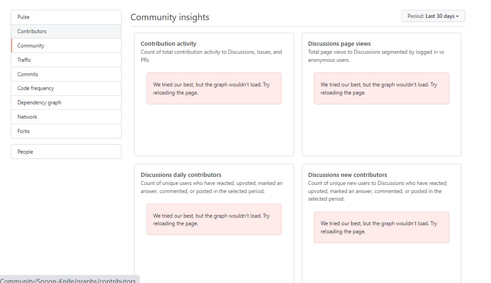
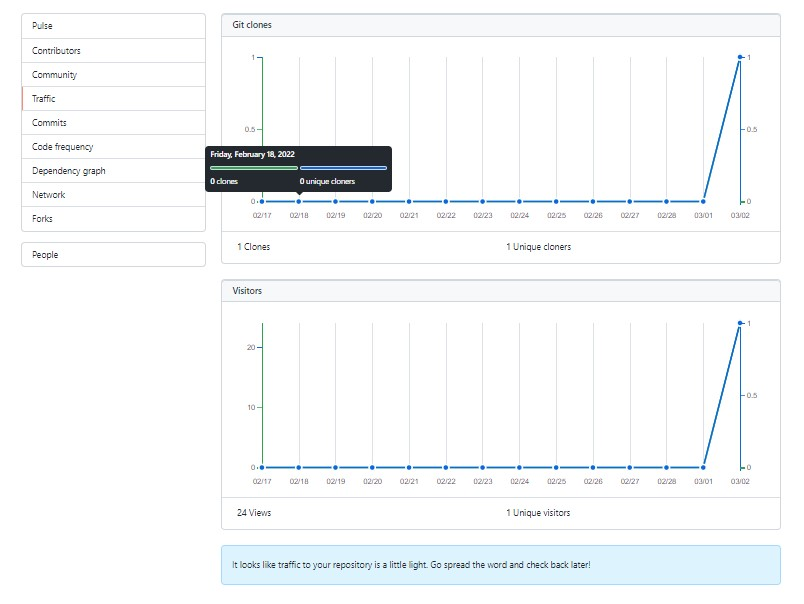
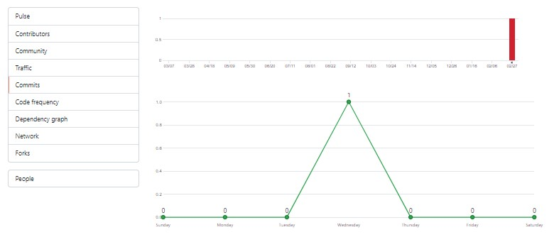
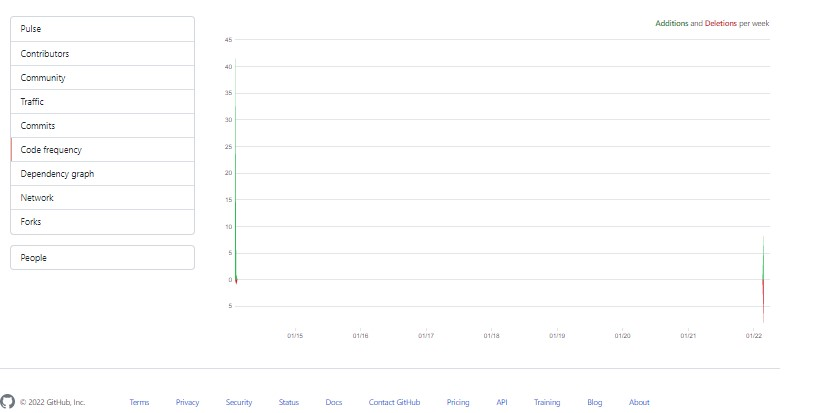

# Tool 5 : Continuous Integration

# Stting Up Travis CI

# - membuat file hello.js, package.json, grunt.js, .travis.yml.

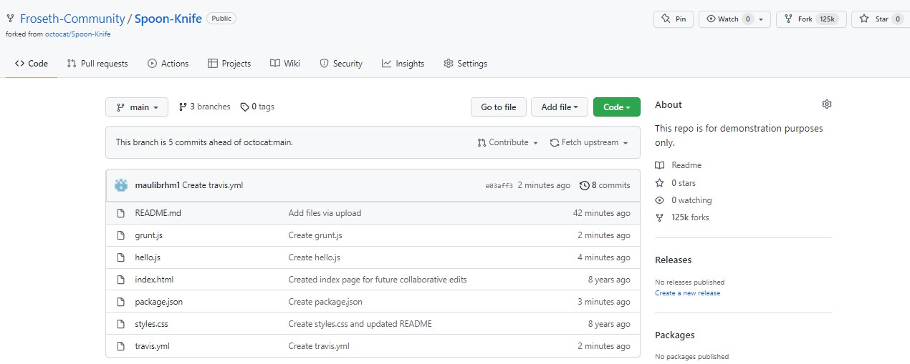

# Travis CI

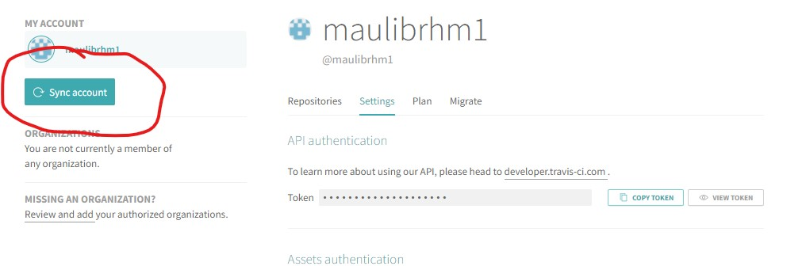
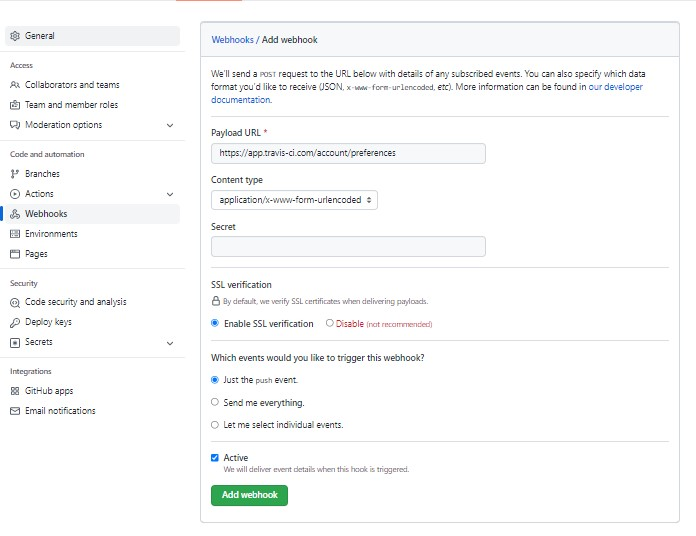
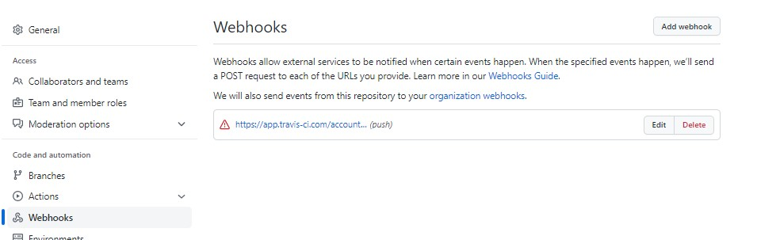

# Tools 6 : Code Review

# - compare

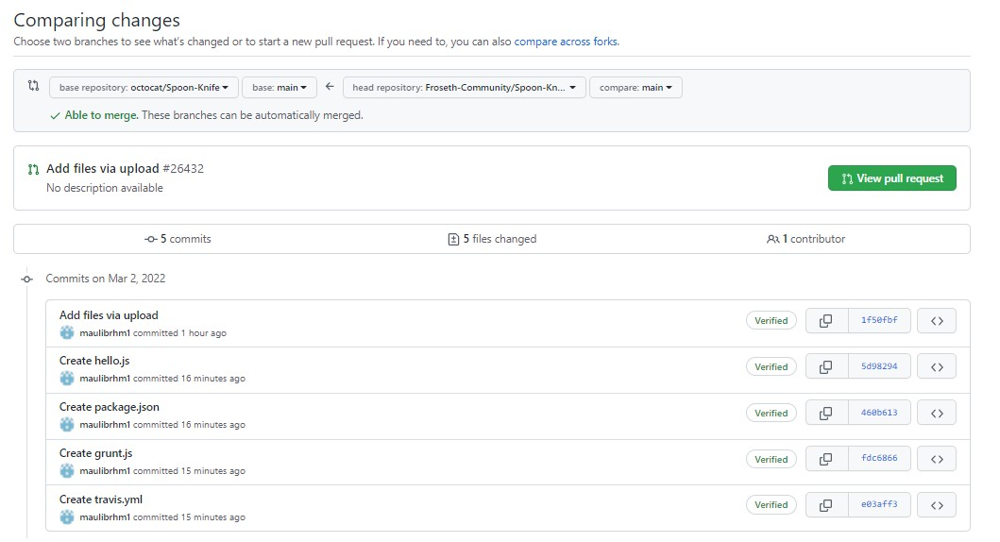
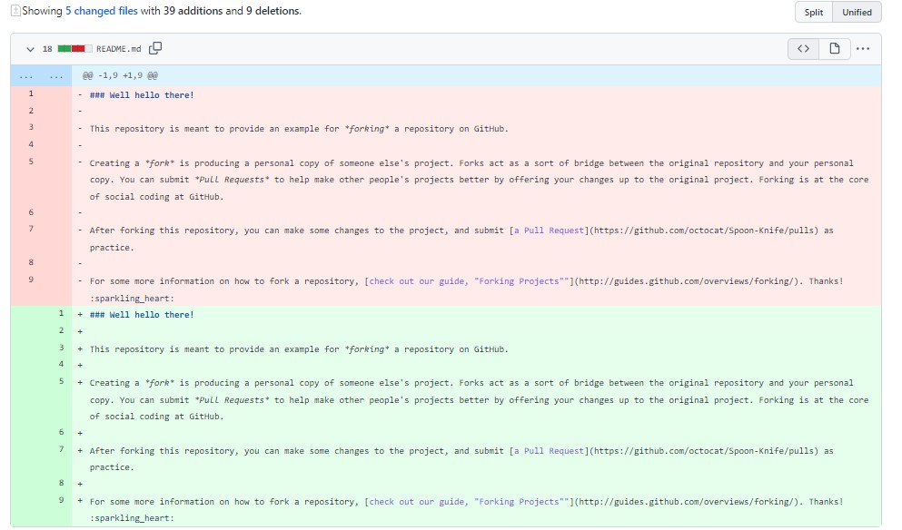

# Tools 7 : Documenting

# - github wiki
